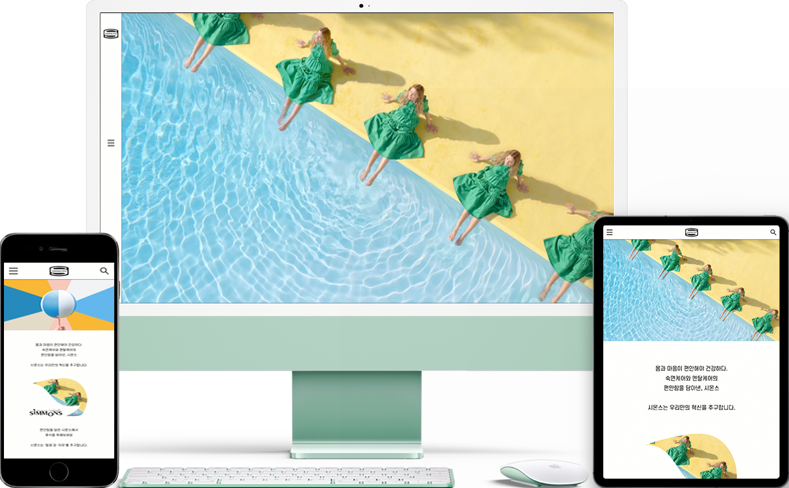

# Second Project : Simmons
> Responsive Renewal Team Project Website
>> 팀프로젝트(4인) : 반응형 리뉴얼 웹사이트
- 소요기간 : 1.5개월 (디자인 + 코딩 포함)
- 사용기술 : HTML5, CSS3, Sass, Javascript
- 구현페이지 : Main, Brand(theBlack, heritage), Gallery(Gallery, Search), Product(Bed, Bedding, Furniture, RoomSet), Product-Details, Community, Login, Insert, Cart, Mypage

* * *
### 1. CONCEPT
**일반적인 세로 스크롤 페이지에서 벗어나 사용자들에게 시각적으로 새로움을 주기 위하여 웹페이지를 가로 스크롤 페이지로 리뉴얼하였습니다. 또한 기존 페이지에서는 지원하지 않던 반응형 페이지를 코딩하였고, 메인페이지에 다양한 정보를 제공할 수 있도록 디자인을 하였습니다.** 
### GRID
- Full Width : 1920px
- Grid Width : 1320px
- Column Width : 70px
- Gutter Width : 40px (양쪽 끝 사이드 20px)
- Number of Column : 12

###
###

* * *
### 2. COLOR & FONT
### COLOR
**힐링이라는 브랜드 컨셉에 맞추어서 사용자에게 편안함을 줄 수 있는 그린 계열의 색상을 포인트 컬러로 사용하였습니다.** 
> white color : #fefefc (R:254, G:254, B:100)

> blakc color : #333333 (R:51, G:51, B:51)

> point color : #82ca9c (R:130, G:202, B:156)

###
### FONT
**메인 폰트로는 S-Core Dream, 그 외의 포인트 폰트로는 카페24 단정해, Ramaraja를 사용하였습니다.** 

* * *
### 3. PAGE
**팀원 4명이 함께 Main, Brand(theBlack, heritage), Gallery(Gallery, Search), Product(Bed, Bedding, Furniture, RoomSet), Product-Details, Community, Login, Insert, Cart, Mypage페이지를 기획, 디자인, 코딩하였습니다.**

***"해당 팀 프로젝트의 개인별 구현 페이지, 기여도는 개인 프로필 사이트에서 자세하게 확인하실 수 있습니다."***

[Simmons사이트보기](http://sj19990823.dothome.co.kr/index.html, Simmons)
김수진 : [프로필사이트보기](http://www.suu823.com/, Sujin's Portfolio)